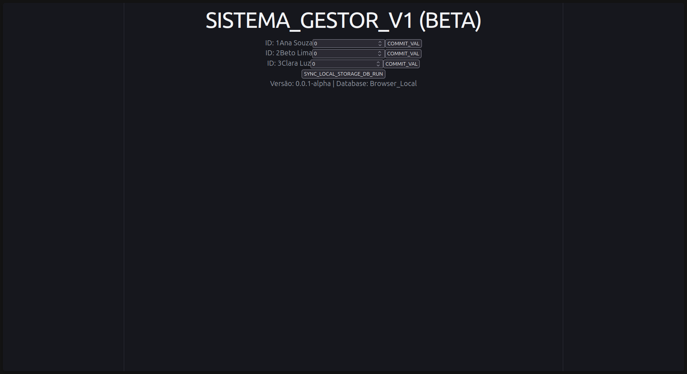
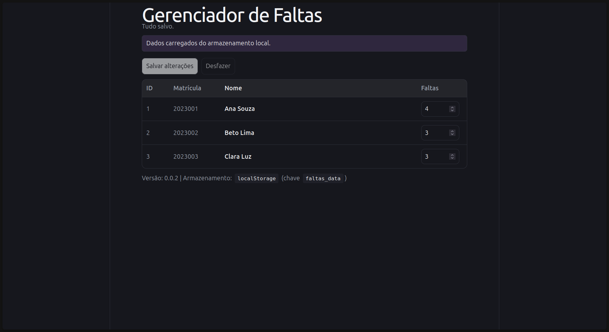
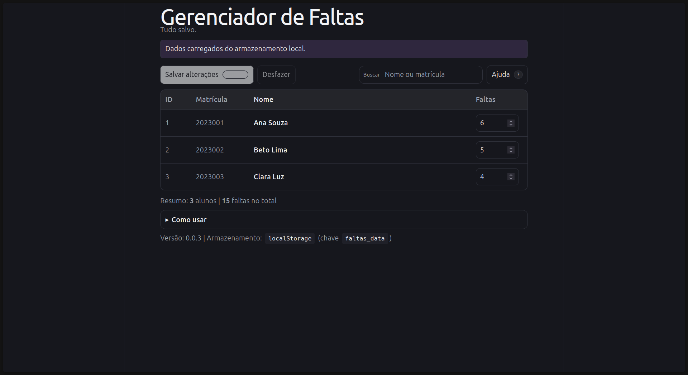
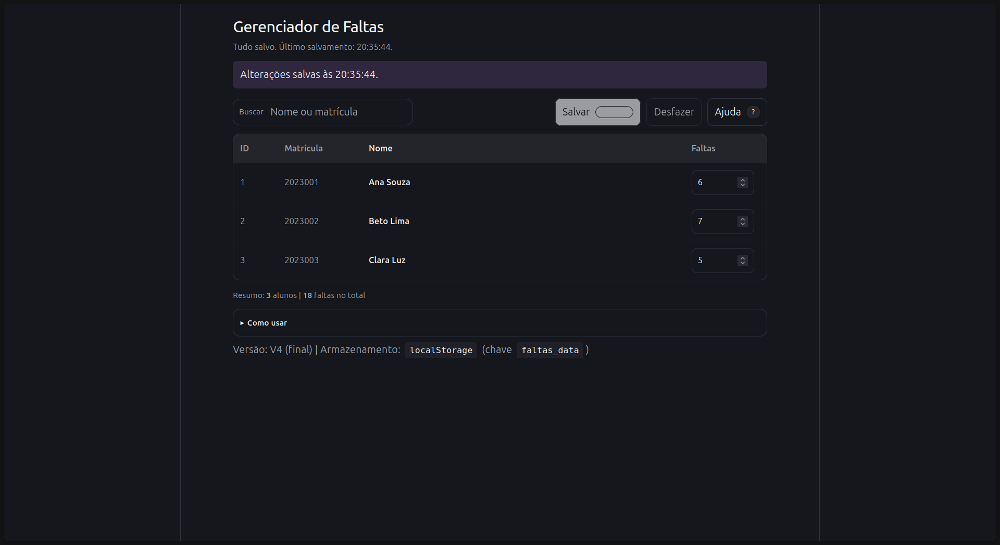

# Gerenciador de Faltas — Trabalho de Heurísticas

Aplicação simples para registrar faltas por aluno, feita em React + Vite e persistência de dados em `localStorage`.

## Objetivo do trabalho

Usar esta aplicação como base para aplicar heurísticas de usabilidade/ IHC, registrando a evolução a cada nova heurística utilizada.

## Como rodar

- Instalar dependências: `npm install`
- Rodar em dev: `npm run dev`

## Versão 1:

- Lista fixa de alunos (inicializa com 3 se o storage estiver vazio)
- Campo numérico para alterar faltas
- Botões que salvam em `localStorage` (chave `faltas_data`)

## Versão 2:

Mudanças focadas em deixar o sistema mais “explicável” e previsível para o usuário

- Feedback de status ao salvar (mostra confirmação com horário)
- Indicação de “alterações não salvas”
- Botões renomeados para linguagem mais comum e intuitiva “Salvar alterações”, “Desfazer”
- Controle e liberdade: opção de desfazer e voltar ao último salvamento
- Prevenção de erros: limite de faltas (0 a 99) e entrada inteira

## Versão 3:

Mudanças focadas em reduzir carga de memória (facilitar encontrar/entender ações) e dar mais suporte ao uso.

- Busca por nome ou matrícula (não precisa scrollar a tela para encontrar o aluno)
- Atalho de teclado para salvar (<code>Ctrl/⌘ S</code>)
- Mensagem clara quando não há resultados de busca
- Ajuda rápida dentro do app (passos + atalhos) e tecla <code>?</code> para abrir/fechar
- Tratamento de erro ao salvar (ex.: armazenamento cheio/indisponível)

## Versão 4 (Final):

Mudanças focadas em melhorar estética/organização visual sem adicionar complexidade.

- Layout mais limpo: ações organizadas em blocos (buscar separado de salvar/desfazer/ajuda)
- Tipografia e espaçamento mais discretos
- Melhor leitura no celular: lista responsiva

## Heurísticas (Nielsen) — checklist

- [x] 1. Visibilidade do status do sistema
- [x] 2. Correspondência entre o sistema e o mundo real
- [x] 3. Controle e liberdade do usuário
- [x] 4. Consistência e padrões
- [x] 5. Prevenção de erros
- [x] 6. Reconhecimento em vez de lembrança
- [x] 7. Flexibilidade e eficiência de uso
- [x] 8. Estética e design minimalista
- [x] 9. Ajudar usuários a reconhecer, diagnosticar e recuperar de erros
- [x] 10. Ajuda e documentação
